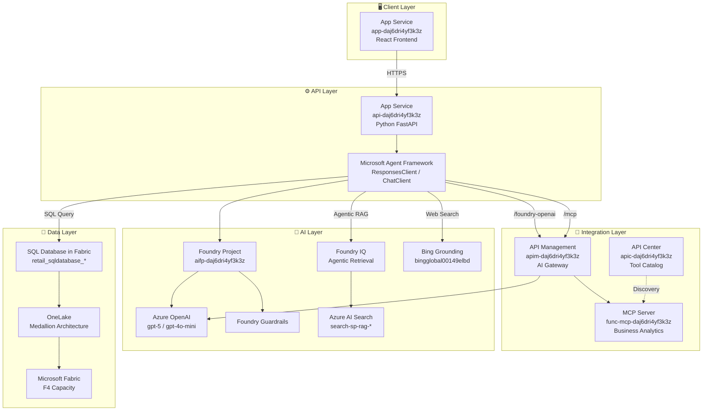

# ARCHITECTURE.md - 技術アーキテクチャ

> **最終更新**: 2026年2月5日 - **Azure 実機環境を確認して**更新

## Azure 実機環境サマリー

| カテゴリ | リソース名 | 値（実機確認 2026/2/5） |
| -------- | ---------- | -------------- |
| **Resource Group** | - | `rg-agent-unified-data-acce-eastus-001` |
| **App Service (API)** | `api-daj6dri4yf3k3z` | Linux Container @ East US |
| **App Service (Frontend)** | `app-daj6dri4yf3k3z` | Linux Container @ East US |
| **Container Registry** | `crda672axowukix3.azurecr.io` | Premium @ East US |
| **Azure AI Services** | `aisa-daj6dri4yf3k3z` | AIServices @ East US |
| **AI Foundry Project** | `aifp-daj6dri4yf3k3z` | East US |
| **Azure AI Search** | `search-sp-rag-australiaeast-001` | Standard @ Australia East |
| **API Management** | `apim-daj6dri4yf3k3z` | Consumption @ Australia East |
| **API Center** | `apic-daj6dri4yf3k3z` | Free @ Australia East |
| **MCP Server** | `func-mcp-daj6dri4yf3k3z` | Azure Functions Python 3.12 |
| **LLM Model** | gpt-5 | 500K TPM |
| **LLM Model (Mini)** | gpt-4o-mini | 30K TPM |
| **Embedding** | text-embedding-3-large | 500K TPM |
| **Bing Connection** | `bingglobal00149elbd` | Web Search |

---

## 全体アーキテクチャ図

```
┌─────────────────────────────────────────────────────────────────────────────────────────────┐
│                                    CLIENT LAYER                                              │
│  ┌───────────────────────────────────────────────────────────────────────────────────────┐  │
│  │  Azure App Service (app-daj6dri4yf3k3z)                                               │  │
│  │  ├─ React + TypeScript Frontend                                                       │  │
│  │  ├─ Natural Language Query Interface                                                  │  │
│  │  ├─ Agent Mode Selector (sql_only / multi_tool / handoff / magentic)                 │  │
│  │  ├─ Doc Search Reasoning Effort (minimal / low / medium)                             │  │
│  │  └─ Built-in Auth (Entra ID EasyAuth)                                                │  │
│  └───────────────────────────────────────────────────────────────────────────────────────┘  │
└──────────────────────────────────────────┬──────────────────────────────────────────────────┘
                                           │ HTTPS
┌──────────────────────────────────────────▼──────────────────────────────────────────────────┐
│                                    API LAYER                                                 │
│  ┌───────────────────────────────────────────────────────────────────────────────────────┐  │
│  │  Azure App Service (api-daj6dri4yf3k3z) - Python FastAPI                              │  │
│  │  ├─ /api/chat - Main chat endpoint (streaming SSE)                                   │  │
│  │  ├─ /api/conversations - Conversation history                                         │  │
│  │  ├─ /health - Health check                                                            │  │
│  │  └─ Agent Orchestration (Microsoft Agent Framework)                                  │  │
│  │      ├─ sql_only mode   → AzureOpenAIResponsesClient + SQL Tool                      │  │
│  │      ├─ multi_tool mode → AzureOpenAIResponsesClient + All Tools                     │  │
│  │      ├─ handoff mode    → AzureOpenAIChatClient + HandoffBuilder                     │  │
│  │      └─ magentic mode   → AzureOpenAIChatClient + MagenticBuilder                    │  │
│  └───────────────────────────────────────────────────────────────────────────────────────┘  │
└───────────────────┬─────────────────────────────────────────────────────┬────────────────────┘
                    │                                                     │
┌───────────────────▼─────────────────────────────────────────────────────▼────────────────────┐
│                              INTEGRATION LAYER (AI Gateway)                                  │
│                                                                                              │
│  ┌─────────────────────────────────┐  ┌─────────────────────────────────┐                   │
│  │  API Management                 │  │  API Center                     │                   │
│  │  (apim-daj6dri4yf3k3z)          │  │  (apic-daj6dri4yf3k3z)          │                   │
│  │  Consumption SKU                │  │  Free SKU                       │                   │
│  │                                 │  │                                 │                   │
│  │  APIs:                          │  │  Tool Catalog:                  │                   │
│  │  ├─ /openai                     │  │  ├─ Business Analytics MCP     │                   │
│  │  │   → Azure OpenAI (legacy)    │  │  │   ├─ YoY Analysis           │                   │
│  │  ├─ /foundry-openai/openai/v1/  │  │  │   ├─ RFM Segmentation       │                   │
│  │  │   → Foundry AI Services ★    │  │  │   ├─ 在庫分析               │                   │
│  │  ├─ /mcp                        │  │  │   ├─ 季節トレンド           │                   │
│  │  │   → MCP Server               │  │  │   └─ 地域パフォーマンス     │                   │
│  │  └─ /foundry-agents             │  │  └─ Azure OpenAI API           │                   │
│  │      → Foundry Agent Service    │  │                                 │                   │
│  │                                 │  └─────────────────────────────────┘                   │
│  │  Features:                      │                                                        │
│  │  ├─ Circuit Breaker (30s)       │  ┌─────────────────────────────────┐                   │
│  │  ├─ Token Metrics Headers       │  │  MCP Server                     │                   │
│  │  ├─ Managed Identity Auth       │  │  (func-mcp-daj6dri4yf3k3z)      │                   │
│  │  └─ Latency Measurement         │  │  Azure Functions Python 3.12   │                   │
│  └─────────────────────────────────┘  │                                 │                   │
│                                       │  Endpoints:                     │                   │
│                                       │  ├─ /api/mcp (JSON-RPC 2.0)    │                   │
│                                       │  └─ /api/tools/{tool_name}     │                   │
│                                       └─────────────────────────────────┘                   │
└───────────────────┬─────────────────────────────────────────────────────────────────────────┘
                    │
┌───────────────────▼─────────────────────────────────────────────────────────────────────────┐
│                                    AI LAYER                                                  │
│                                                                                              │
│  ┌─────────────────────────────────────────────────────────────────────────────────────┐    │
│  │  Microsoft Foundry (aisa-daj6dri4yf3k3z / aifp-daj6dri4yf3k3z)                      │    │
│  │                                                                                      │    │
│  │  ┌─────────────────────┐  ┌─────────────────────┐  ┌─────────────────────────────┐  │    │
│  │  │  Azure OpenAI       │  │  Foundry Guardrails │  │  Foundry IQ (Agentic RAG)   │  │    │
│  │  │                     │  │                     │  │                             │  │    │
│  │  │  Models:            │  │  ├─ Task Adherence  │  │  Knowledge Base:            │  │    │
│  │  │  ├─ gpt-5 (500K)    │  │  ├─ Prompt Shields  │  │  └─ product-specs-kb        │  │    │
│  │  │  ├─ gpt-4o-mini     │  │  ├─ Spotlighting    │  │                             │  │    │
│  │  │  │   (30K)          │  │  └─ Groundedness    │  │  Reasoning Effort:          │  │    │
│  │  │  └─ text-embedding  │  │      Detection      │  │  ├─ minimal (直接検索)      │  │    │
│  │  │      -3-large       │  │                     │  │  ├─ low (シングルパス)      │  │    │
│  │  │      (500K)         │  │                     │  │  └─ medium (反復検索)       │  │    │
│  │  └─────────────────────┘  └─────────────────────┘  └─────────────────────────────┘  │    │
│  │                                                                                      │    │
│  │  ┌─────────────────────┐  ┌─────────────────────────────────────────────────────┐   │    │
│  │  │  Bing Grounding     │  │  Project Connections                                │   │    │
│  │  │                     │  │                                                     │   │    │
│  │  │  Connection:        │  │  ├─ bingglobal00149elbd (Bing Search)               │   │    │
│  │  │  bingglobal00149elbd│  │  ├─ AI Search Connection                            │   │    │
│  │  │                     │  │  └─ Fabric SQL Connection                           │   │    │
│  │  │  Tool Pattern:      │  │                                                     │   │    │
│  │  │  BingGroundingAgent │  └─────────────────────────────────────────────────────┘   │    │
│  │  │  Tool               │                                                            │    │
│  │  └─────────────────────┘                                                            │    │
│  └─────────────────────────────────────────────────────────────────────────────────────┘    │
│                                                                                              │
│  ┌─────────────────────────────────────────────────────────────────────────────────────┐    │
│  │  Azure AI Search (search-sp-rag-australiaeast-001) - Standard SKU                   │    │
│  │  ├─ Index: product-specs-sharepoint-ks-index                                        │    │
│  │  └─ API Version: 2025-11-01-preview                                                 │    │
│  └─────────────────────────────────────────────────────────────────────────────────────┘    │
└───────────────────┬─────────────────────────────────────────────────────────────────────────┘
                    │
┌───────────────────▼─────────────────────────────────────────────────────────────────────────┐
│                                    DATA LAYER                                                │
│                                                                                              │
│  ┌─────────────────────────────────────────────────────────────────────────────────────┐    │
│  │  Microsoft Fabric (capagentunifieddata001) - F4 Capacity                            │    │
│  │                                                                                      │    │
│  │  ┌─────────────────────────────────────────────────────────────────────────────┐    │    │
│  │  │  SQL Database in Fabric                                                     │    │    │
│  │  │  retail_sqldatabase_daj6dri4yf3k3z-c9a4f960-6dfe-4e75-8ef6-ac9ef3f35e44    │    │    │
│  │  │                                                                             │    │    │
│  │  │  Business Data Tables:          History Tables:                             │    │    │
│  │  │  ├─ customers                   ├─ hst_conversations                        │    │    │
│  │  │  ├─ products                    └─ hst_conversation_messages                │    │    │
│  │  │  ├─ orders                                                                  │    │    │
│  │  │  ├─ order_items                                                             │    │    │
│  │  │  └─ inventory                                                               │    │    │
│  │  └─────────────────────────────────────────────────────────────────────────────┘    │    │
│  │                                                                                      │    │
│  │  ┌─────────────────────────────────────────────────────────────────────────────┐    │    │
│  │  │  OneLake (Medallion Architecture)                                           │    │    │
│  │  │  ├─ Bronze: Raw Data                                                        │    │    │
│  │  │  ├─ Silver: Validated/Cleansed                                              │    │    │
│  │  │  └─ Gold: Business-Ready                                                    │    │    │
│  │  └─────────────────────────────────────────────────────────────────────────────┘    │    │
│  └─────────────────────────────────────────────────────────────────────────────────────┘    │
└─────────────────────────────────────────────────────────────────────────────────────────────┘
```

---

## ツールアーキテクチャ詳細

```
┌─────────────────────────────────────────────────────────────────────────────────────────────┐
│                              AGENT TOOLS ARCHITECTURE                                        │
│                                                                                              │
│  ┌─────────────────────────────────────────────────────────────────────────────────────┐    │
│  │  Agent Framework Tool Registry                                                      │    │
│  │                                                                                      │    │
│  │  @ai_function decorated tools:                                                      │    │
│  │  ┌─────────────────────┐  ┌─────────────────────┐  ┌─────────────────────┐         │    │
│  │  │  SQL Tool           │  │  Doc Tool           │  │  Web Tool           │         │    │
│  │  │  sql_agent.py       │  │  agentic_retrieval  │  │  web_agent.py       │         │    │
│  │  │                     │  │  _tool.py           │  │                     │         │    │
│  │  │  execute_sql_query  │  │                     │  │  search_web         │         │    │
│  │  │  ()                 │  │  search_documents() │  │  ()                 │         │    │
│  │  │                     │  │                     │  │                     │         │    │
│  │  │  Backend:           │  │  Backend:           │  │  Backend:           │         │    │
│  │  │  Fabric SQL DB      │  │  Foundry IQ         │  │  Bing Grounding     │         │    │
│  │  │  (pyodbc)           │  │  (Agentic RAG)      │  │  AgentTool          │         │    │
│  │  └─────────────────────┘  └─────────────────────┘  └─────────────────────┘         │    │
│  │                                                                                      │    │
│  │  MCP Tools (via APIM Gateway):                                                      │    │
│  │  ┌─────────────────────────────────────────────────────────────────────────────┐    │    │
│  │  │  MCP Server (func-mcp-daj6dri4yf3k3z)                                       │    │    │
│  │  │                                                                             │    │    │
│  │  │  ├─ analyze_yoy_performance()     - 前年比分析                              │    │    │
│  │  │  ├─ analyze_rfm_segments()        - 顧客セグメンテーション (RFM)            │    │    │
│  │  │  ├─ analyze_inventory()           - 在庫最適化分析                          │    │    │
│  │  │  ├─ analyze_seasonal_trends()     - 季節トレンド分析                        │    │    │
│  │  │  └─ analyze_regional_performance()- 地域パフォーマンス分析                  │    │    │
│  │  │                                                                             │    │    │
│  │  │  Protocol: JSON-RPC 2.0 over HTTP                                           │    │    │
│  │  │  Endpoint: https://apim-*/mcp → https://func-mcp-*/api/mcp                  │    │    │
│  │  └─────────────────────────────────────────────────────────────────────────────┘    │    │
│  └─────────────────────────────────────────────────────────────────────────────────────┘    │
└─────────────────────────────────────────────────────────────────────────────────────────────┘
```

---

## Mermaid 図



## エージェントモード詳細

```
┌─────────────────────────────────────────────────────────────────────────────────────────────┐
│                              AGENT MODES ARCHITECTURE                                        │
│                                                                                              │
│  ┌──────────────────────────────────────────────────────────────────────────────────────┐   │
│  │  Mode Selection (Frontend → /api/chat?agent_mode=xxx)                                │   │
│  │                                                                                      │   │
│  │  ┌─────────────────┐  ┌─────────────────┐  ┌─────────────────┐  ┌─────────────────┐ │   │
│  │  │  sql_only       │  │  multi_tool ★   │  │  handoff        │  │  magentic       │ │   │
│  │  │                 │  │                 │  │                 │  │                 │ │   │
│  │  │  ⚡ 最速        │  │  🔥 推奨        │  │  普通           │  │  遅い           │ │   │
│  │  │  SQL専用        │  │  全ツール       │  │  専門家委譲     │  │  マネージャー   │ │   │
│  │  │                 │  │                 │  │                 │  │  統合           │ │   │
│  │  │  Client:        │  │  Client:        │  │  Client:        │  │  Client:        │ │   │
│  │  │  Responses ✓    │  │  Responses ✓    │  │  Chat (SDK制約) │  │  Chat (SDK制約) │ │   │
│  │  │                 │  │                 │  │                 │  │                 │ │   │
│  │  │  Tools:         │  │  Tools:         │  │  Tools:         │  │  Tools:         │ │   │
│  │  │  └─ SQL         │  │  ├─ SQL         │  │  Specialists:   │  │  Specialists:   │ │   │
│  │  │                 │  │  ├─ Doc         │  │  ├─ SQL Agent   │  │  ├─ SQL Agent   │ │   │
│  │  │                 │  │  ├─ Web         │  │  ├─ Doc Agent   │  │  ├─ Doc Agent   │ │   │
│  │  │                 │  │  └─ MCP(5)      │  │  └─ Web Agent   │  │  └─ Web Agent   │ │   │
│  │  └─────────────────┘  └─────────────────┘  └─────────────────┘  └─────────────────┘ │   │
│  │                                                                                      │   │
│  │  Note: handoff/magentic は HandoffBuilder/MagenticBuilder SDK が                     │   │
│  │        AzureOpenAIChatClient を要求するため ChatClient を維持                        │   │
│  └──────────────────────────────────────────────────────────────────────────────────────┘   │
└─────────────────────────────────────────────────────────────────────────────────────────────┘
```

### モード選択ガイド

| モード | Client | 速度 | 用途 | 特徴 |
|--------|--------|------|------|------|
| `sql_only` | ResponsesClient | ⚡最速 | 単純なSQLクエリ | SQLツールのみ |
| `multi_tool` | ResponsesClient | 🔥高速 | **推奨** - 汎用 | LLMが最適ツール選択 |
| `handoff` | ChatClient | 普通 | 専門家委譲 | 結果は統合されない |
| `magentic` | ChatClient | 遅い | 複雑な分析 | マネージャーが結果統合 |

---

## API Management (AI Gateway) 詳細

```
┌─────────────────────────────────────────────────────────────────────────────────────────────┐
│                              API MANAGEMENT CONFIGURATION                                    │
│                              apim-daj6dri4yf3k3z (Consumption SKU)                          │
│                                                                                              │
│  ┌──────────────────────────────────────────────────────────────────────────────────────┐   │
│  │  Registered APIs                                                                     │   │
│  │                                                                                      │   │
│  │  ┌─────────────────────────────────────────────────────────────────────────────┐    │   │
│  │  │  /openai (Legacy)                                                           │    │   │
│  │  │  Backend: https://aisa-daj6dri4yf3k3z.openai.azure.com                      │    │   │
│  │  └─────────────────────────────────────────────────────────────────────────────┘    │   │
│  │                                                                                      │   │
│  │  ┌─────────────────────────────────────────────────────────────────────────────┐    │   │
│  │  │  /foundry-openai/openai/v1/ ★ Primary                                       │    │   │
│  │  │  Backend: https://aisa-daj6dri4yf3k3z.services.ai.azure.com                 │    │   │
│  │  │  → Used by AzureOpenAIResponsesClient                                       │    │   │
│  │  └─────────────────────────────────────────────────────────────────────────────┘    │   │
│  │                                                                                      │   │
│  │  ┌─────────────────────────────────────────────────────────────────────────────┐    │   │
│  │  │  /mcp                                                                       │    │   │
│  │  │  Backend: https://func-mcp-daj6dri4yf3k3z.azurewebsites.net                 │    │   │
│  │  └─────────────────────────────────────────────────────────────────────────────┘    │   │
│  │                                                                                      │   │
│  │  ┌─────────────────────────────────────────────────────────────────────────────┐    │   │
│  │  │  /foundry-agents                                                            │    │   │
│  │  │  Backend: Foundry Agent Service                                             │    │   │
│  │  └─────────────────────────────────────────────────────────────────────────────┘    │   │
│  └──────────────────────────────────────────────────────────────────────────────────────┘   │
│                                                                                              │
│  ┌──────────────────────────────────────────────────────────────────────────────────────┐   │
│  │  AI Gateway Features                                                                 │   │
│  │                                                                                      │   │
│  │  ├─ Circuit Breaker: 429/500-599 errors → 30s trip duration                         │   │
│  │  ├─ Token Metrics: x-openai-{prompt,completion,total}-tokens headers                │   │
│  │  ├─ Latency: x-gateway-latency-ms header                                            │   │
│  │  ├─ Authentication: Managed Identity (DefaultAzureCredential)                       │   │
│  │  └─ Note: llm-emit-token-metric not supported on Consumption SKU                    │   │
│  └──────────────────────────────────────────────────────────────────────────────────────┘   │
└─────────────────────────────────────────────────────────────────────────────────────────────┘
```

---

## プロンプトモジュール

```
src/api/python/prompts/
├── __init__.py          # エクスポート
├── sql_agent.py         # SQL_AGENT_PROMPT
├── web_agent.py         # WEB_AGENT_PROMPT
├── doc_agent.py         # DOC_AGENT_PROMPT
├── manager_agent.py     # MANAGER_AGENT_PROMPT
├── unified_agent.py     # UNIFIED_AGENT_PROMPT
└── triage_agent.py      # TRIAGE_AGENT_PROMPT
```

---

## デプロイ構成

### GitHub Actions（現在の方式）

```
git push → GitHub Actions → Docker Build → ACR Push → App Service Restart
```

| コンポーネント | トリガー |
|---------------|---------|
| Frontend | `src/App/**` 変更時 |
| API | `src/api/python/**` 変更時 |
| Agents | `infra/scripts/agent_scripts/agents/**` 変更時 |

### azd up（初回セットアップ用）

```bash
azd up
├── provision (Bicep)
│   ├── Resource Group
│   ├── Container Registry
│   ├── App Service Plan
│   ├── App Service (Frontend)
│   ├── App Service (API)
│   ├── Azure OpenAI / AI Services
│   ├── Microsoft Foundry Project
│   ├── Application Insights
│   └── Key Vault
└── deploy
    ├── Frontend (App Service)
    └── API (App Service)
```

---

## 外部依存

| サービス | 用途 | 必須 |
|----------|------|------|
| **Microsoft Fabric** | F4 Capacity 以上 | ✅ 必須 |
| **Azure OpenAI** | gpt-5 / gpt-4o-mini | ✅ 必須 |
| **Azure AI Search** | ドキュメント検索 (Foundry IQ) | ✅ 必須 |
| **Bing Search (Grounding)** | Web検索 | ✅ 必須 |

---

## 関連ドキュメント

詳細は `documents/` フォルダ内の以下を参照:

- [TechnicalArchitecture.md](./documents/TechnicalArchitecture.md) - 技術詳細
- [DeploymentGuide.md](./documents/DeploymentGuide.md) - デプロイガイド
- [LocalDevelopmentSetup.md](./documents/LocalDevelopmentSetup.md) - ローカル開発
- [GitHubActionsSetup.md](./documents/GitHubActionsSetup.md) - CI/CD 設定
