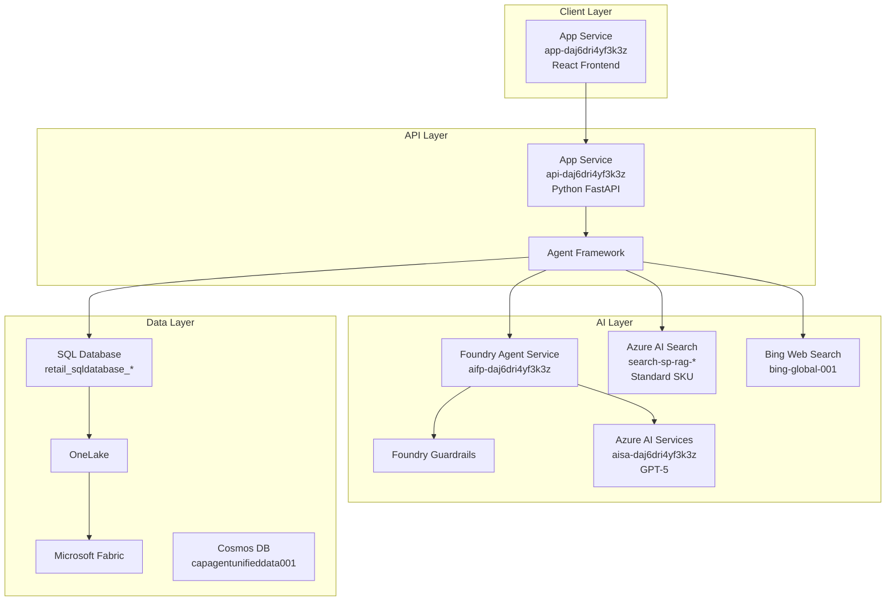
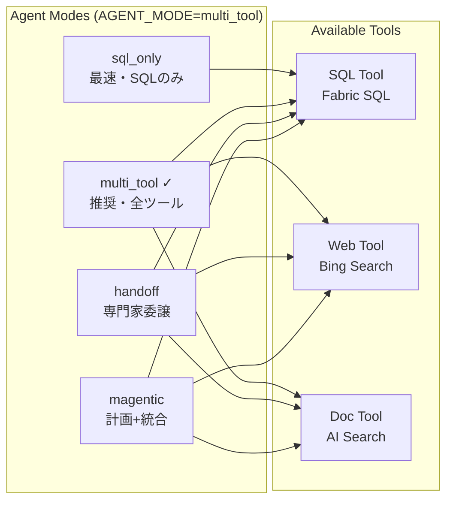

# ARCHITECTURE.md - 技術アーキテクチャ

> **最終更新**: 2026年2月3日 - **Azure 実機環境を確認して**更新

## Azure 実機環境サマリー

| カテゴリ | リソース名 | 値（実機確認） |
| -------- | ---------- | -------------- |
| **Resource Group** | - | `rg-agent-unified-data-acce-eastus-001` |
| **App Service (API)** | `api-daj6dri4yf3k3z` | Running @ Australia East |
| **App Service (Frontend)** | `app-daj6dri4yf3k3z` | Running @ Australia East |
| **Container Registry** | `crda672axowukix3` | Premium @ East US |
| **Azure AI Services** | `aisa-daj6dri4yf3k3z` | S0 @ East US |
| **AI Foundry Project** | `aifp-daj6dri4yf3k3z` | East US |
| **Azure AI Search** | `search-sp-rag-australiaeast-001` | Standard @ Australia East |
| **Bing Search** | `bing-global-001` | Global |
| **LLM Model** | `AZURE_OPENAI_DEPLOYMENT_MODEL` | **gpt-5** |
| **AGENT_MODE** | 環境変数 | **multi_tool** |
| **MULTI_AGENT_MODE** | 環境変数 | **true** |

## 全体構成



## コンポーネント詳細

| Layer | Component | Service | リソース名 | 役割 |
| ----- | --------- | ------- | ---------- | ---- |
| Client | Frontend | App Service | `app-daj6dri4yf3k3z` | React UI |
| API | Backend | App Service | `api-daj6dri4yf3k3z` | REST API (FastAPI) |
| API | Agent | Agent Framework | - | エージェント実行・ツール呼び出し |
| AI | Runtime | Foundry Agent Service | `aifp-daj6dri4yf3k3z` | 会話管理 |
| AI | Security | Guardrails | - | 安全性・ハルシネーション防止 |
| AI | LLM | Azure AI Services | `aisa-daj6dri4yf3k3z` | **GPT-5** |
| AI | Search | Azure AI Search | `search-sp-rag-*` | ドキュメント検索 |
| AI | Web | Bing Search | `bing-global-001` | Web検索 |
| Data | Platform | Microsoft Fabric | - | 統合データ基盤 |
| Data | Database | SQL DB in Fabric | `retail_sqldatabase_*` | 構造化データ |
| Data | History | Fabric SQL DB | `hst_conversations`, `hst_conversation_messages` | 会話履歴 |
| Data | Lake | OneLake | - | 生データ (Medallion) |

## エージェント構成



### モード選択ガイド

| モード | 速度 | 用途 | 特徴 |
|--------|------|------|------|
| `sql_only` | ⚡最速 | 単純なSQLクエリ | SQLツールのみ |
| `multi_tool` | 🔥高速 | **推奨** - 汎用 | LLMが最適ツール選択 |
| `handoff` | 普通 | 専門家委譲 | 結果は統合されない |
| `magentic` | 遅い | 複雑な分析 | マネージャーが結果統合 |

## プロンプトモジュール

```
src/api/python/prompts/
├── __init__.py          # エクスポート
├── sql_agent.py         # SQL_AGENT_PROMPT
├── web_agent.py         # WEB_AGENT_PROMPT
├── doc_agent.py         # DOC_AGENT_PROMPT
├── manager_agent.py     # MANAGER_AGENT_PROMPT
├── unified_agent.py     # UNIFIED_AGENT_PROMPT
└── triage_agent.py      # TRIAGE_AGENT_PROMPT
```

## デプロイ構成

### GitHub Actions（現在の方式）

```
git push → GitHub Actions → Docker Build → ACR Push → App Service
```

| コンポーネント | トリガー |
|---------------|---------|
| Frontend | `src/App/**` 変更時 |
| API | `src/api/python/**` 変更時 |
| Agents | `infra/scripts/agent_scripts/agents/**` 変更時 |

### azd up（初回セットアップ用）

```bash
azd up
├── provision (Bicep)
│   ├── Resource Group
│   ├── Container Registry
│   ├── App Service Plan
│   ├── App Service (Frontend)
│   ├── App Service (API)
│   ├── Azure OpenAI
│   ├── Microsoft Foundry
│   ├── Application Insights
│   └── Key Vault
└── deploy
    ├── Frontend (App Service)
    └── API (App Service)
```

## 外部依存

- **Microsoft Fabric** - F2 Capacity 以上（事前プロビジョニング必要）
- **Azure OpenAI** - GPT-4o クォータ
- **Azure AI Search** - ドキュメント検索用
- **Bing Search API** - Web検索用（オプション）

## 関連ドキュメント

詳細は `documents/` フォルダ内の以下を参照:

- [Implementation-Overview.md](./documents/Implementation-Overview.md) - 実装概要
- [Agent-Architecture.md](./documents/Agent-Architecture.md) - エージェント詳細
- [Prompts-Module.md](./documents/Prompts-Module.md) - プロンプトモジュール
- [Current-Deployment.md](./documents/Current-Deployment.md) - GitHub Actions デプロイ
