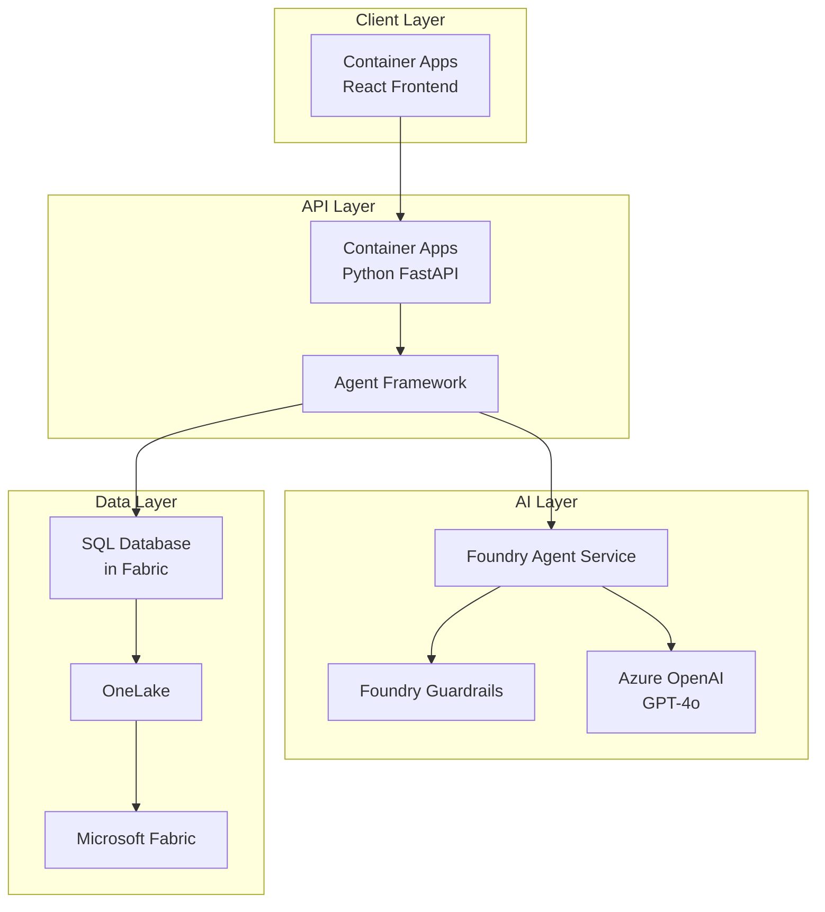

# ARCHITECTURE.md - 技術アーキテクチャ

## 全体構成



## コンポーネント詳細

| Layer | Component | Service | 役割 |
|-------|-----------|---------|------|
| Client | Frontend | Container Apps | React UI |
| API | Backend | Container Apps | REST API |
| API | Agent | Agent Framework | ツール実行 |
| AI | Runtime | Foundry Agent Service | 会話管理 |
| AI | Security | Guardrails | 安全性 |
| AI | LLM | Azure OpenAI | 推論 |
| Data | Platform | Microsoft Fabric | 統合基盤 |
| Data | Database | SQL DB in Fabric | 構造化データ |
| Data | Lake | OneLake | 生データ |

## デプロイ構成

```bash
azd up
├── provision (Bicep)
│   ├── Resource Group
│   ├── Container Apps Environment
│   ├── Container Registry
│   ├── Azure OpenAI
│   ├── Microsoft Foundry
│   ├── Application Insights
│   └── Key Vault
└── deploy
    ├── API (Container Apps)
    └── Web (Container Apps)
```

## 外部依存

- Microsoft Fabric (事前プロビジョニング必要)
- Azure OpenAI クォータ
