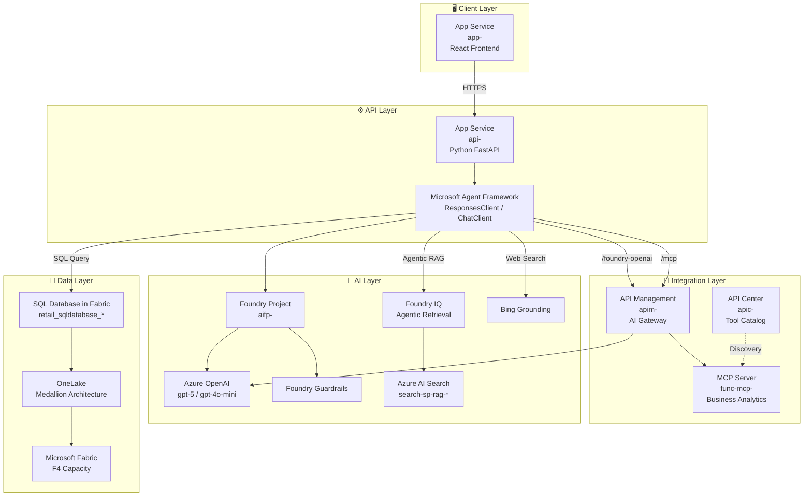

# ARCHITECTURE.md - 技術アーキテクチャ

> **最終更新**: 2026年2月8日 - 品質監査完了を反映して更新

## Azure 実機環境サマリー

| カテゴリ | リソース名 | 値（実機確認 2026/2/5） |
| -------- | ---------- | -------------- |
| **Resource Group** | - | `<your-resource-group>` |
| **App Service (API)** | `api-<your-suffix>` | Linux Container @ East US |
| **App Service (Frontend)** | `app-<your-suffix>` | Linux Container @ East US |
| **Container Registry** | `<your-acr-name>.azurecr.io` | Premium @ East US |
| **Azure AI Services** | `aisa-<your-suffix>` | AIServices @ East US |
| **AI Foundry Project** | `aifp-<your-suffix>` | East US |
| **Azure AI Search** | `<your-ai-search-name>` | Standard @ Australia East |
| **API Management** | `apim-<your-suffix>` | Consumption @ Australia East |
| **API Center** | `apic-<your-suffix>` | Free @ Australia East |
| **MCP Server** | `func-mcp-<your-suffix>` | Azure Functions Python 3.12 |
| **LLM Model** | gpt-5 | 500K TPM |
| **LLM Model (Mini)** | gpt-4o-mini | 30K TPM |
| **Embedding** | text-embedding-3-large | 500K TPM |
| **Bing Connection** | `<your-bing-connection-name>` | Web Search |

---

## 全体アーキテクチャ図

```
┌─────────────────────────────────────────────────────────────────────────────────────────────┐
│                                    CLIENT LAYER                                             │
│  ┌───────────────────────────────────────────────────────────────────────────────────────┐  │
│  │  Azure App Service (app-<your-suffix>)                                                 │ │
│  │  ├─ React + TypeScript Frontend                                                       │  │
│  │  ├─ Natural Language Query Interface                                                  │  │
│  │  ├─ Agent Mode Selector (sql_only / multi_tool / handoff / magentic)                 │   │
│  │  ├─ Doc Search Reasoning Effort (minimal / low / medium)                             │   │
│  │  └─ Built-in Auth (Entra ID EasyAuth)                                                │   │
│  └───────────────────────────────────────────────────────────────────────────────────────┘  │
└──────────────────────────────────────────┬──────────────────────────────────────────────────┘
                                           │ HTTPS
┌──────────────────────────────────────────▼──────────────────────────────────────────────────┐
│                                    API LAYER                                                │
│  ┌───────────────────────────────────────────────────────────────────────────────────────┐  │
│  │  Azure App Service (api-<your-suffix>) - Python FastAPI                                │ │
│  │  ├─ /api/chat - Main chat endpoint (streaming SSE)                                   │   │
│  │  ├─ /api/conversations - Conversation history                                         │  │
│  │  ├─ /health - Health check                                                            │  │
│  │  └─ Agent Orchestration (Microsoft Agent Framework)                                  │   │
│  │      ├─ sql_only mode   → AzureOpenAIResponsesClient + SQL Tool                      │   │
│  │      ├─ multi_tool mode → AzureOpenAIResponsesClient + All Tools                     │   │
│  │      ├─ handoff mode    → AzureOpenAIChatClient + HandoffBuilder                     │   │
│  │      └─ magentic mode   → AzureOpenAIChatClient + MagenticBuilder                    │   │
│  └───────────────────────────────────────────────────────────────────────────────────────┘  │
└───────────────────┬─────────────────────────────────────────────────────┬───────────────────┘
                    │                                                     │
┌───────────────────▼─────────────────────────────────────────────────────▼───────────────────┐
│                              INTEGRATION LAYER (AI Gateway)                                 │
│                                                                                             │
│  ┌─────────────────────────────────┐  ┌─────────────────────────────────┐                   │
│  │  API Management                 │  │  API Center                     │                   │
│  │  (apim-<your-suffix>)            │  │  (apic-<your-suffix>)            │                 │
│  │  Consumption SKU                │  │  Free SKU                       │                   │
│  │                                 │  │                                 │                   │
│  │  APIs:                          │  │  Tool Catalog:                  │                   │
│  │  ├─ /openai                     │  │  ├─ Business Analytics MCP     │                    │
│  │  │   → Azure OpenAI (legacy)    │  │  │   (16 tools / 4 categories) │                    │
│  │  ├─ /foundry-openai/openai/v1/  │  │  │   売上5/顧客4/在庫3/製品4   │                    │
│  │  │   → Foundry AI Services ★    │  │  │                             │                    │
│  │  ├─ /mcp                        │  │  │                             │                    │
│  │  │   → MCP Server               │  │  └─ Azure OpenAI API           │                    │
│  │  └─ /foundry-agents             │  │  └─ Azure OpenAI API           │                    │
│  │      → Foundry Agent Service    │  │                                 │                   │
│  │                                 │  └─────────────────────────────────┘                   │
│  │  Features:                      │                                                        │
│  │  ├─ Circuit Breaker (30s)       │  ┌─────────────────────────────────┐                   │
│  │  ├─ Token Metrics Headers       │  │  MCP Server                     │                   │
│  │  ├─ Managed Identity Auth       │  │  (func-mcp-<your-suffix>)        │                  │
│  │  └─ Latency Measurement         │  │  Azure Functions Python 3.12   │                    │
│  └─────────────────────────────────┘  │                                 │                   │
│                                       │  Endpoints:                     │                   │
│                                       │  ├─ /api/mcp (JSON-RPC 2.0)    │                    │
│                                       │  └─ /api/tools/{tool_name}     │                    │
│                                       └─────────────────────────────────┘                   │
└───────────────────┬─────────────────────────────────────────────────────────────────────────┘
                    │
┌───────────────────▼─────────────────────────────────────────────────────────────────────────┐
│                                    AI LAYER                                                 │
│                                                                                             │
│  ┌─────────────────────────────────────────────────────────────────────────────────────┐    │
│  │  Microsoft Foundry (aisa-<your-suffix> / aifp-<your-suffix>)                         │   │
│  │                                                                                      │   │
│  │  ┌─────────────────────┐  ┌─────────────────────┐  ┌─────────────────────────────┐  │    │
│  │  │  Azure OpenAI       │  │  Foundry Guardrails │  │  Foundry IQ (Agentic RAG)   │  │    │
│  │  │                     │  │                     │  │                             │  │    │
│  │  │  Models:            │  │  ├─ Task Adherence  │  │  Knowledge Base:            │  │    │
│  │  │  ├─ gpt-5 (500K)    │  │  ├─ Prompt Shields  │  │  └─ product-specs-kb        │  │    │
│  │  │  ├─ gpt-4o-mini     │  │  ├─ Spotlighting    │  │                             │  │    │
│  │  │  │   (30K)          │  │  └─ Groundedness    │  │  Reasoning Effort:          │  │    │
│  │  │  └─ text-embedding  │  │      Detection      │  │  ├─ minimal (直接検索)      │  │    │
│  │  │      -3-large       │  │                     │  │  ├─ low (シングルパス)      │  │    │
│  │  │      (500K)         │  │                     │  │  └─ medium (反復検索)       │  │    │
│  │  └─────────────────────┘  └─────────────────────┘  └─────────────────────────────┘  │    │
│  │                                                                                      │   │
│  │  ┌─────────────────────┐  ┌─────────────────────────────────────────────────────┐   │    │
│  │  │  Bing Grounding     │  │  Project Connections                                │   │    │
│  │  │                     │  │                                                     │   │    │
│  │  │  Connection:        │  │  ├─ <your-bing-connection-name> (Bing Search)        │   │   │
│  │  │  <your-bing-conn>   │  │  ├─ AI Search Connection                            │   │    │
│  │  │                     │  │  └─ Fabric SQL Connection                           │   │    │
│  │  │  Tool Pattern:      │  │                                                     │   │    │
│  │  │  BingGroundingAgent │  └─────────────────────────────────────────────────────┘   │    │
│  │  │  Tool               │                                                            │    │
│  │  └─────────────────────┘                                                            │    │
│  └─────────────────────────────────────────────────────────────────────────────────────┘    │
│                                                                                             │
│  ┌─────────────────────────────────────────────────────────────────────────────────────┐    │
│  │  Azure AI Search (<your-ai-search-name>) - Standard SKU                             │    │
│  │  ├─ Index: product-specs-sharepoint-ks-index                                        │    │
│  │  └─ API Version: 2025-11-01-preview                                                 │    │
│  └─────────────────────────────────────────────────────────────────────────────────────┘    │
└───────────────────┬─────────────────────────────────────────────────────────────────────────┘
                    │
┌───────────────────▼─────────────────────────────────────────────────────────────────────────┐
│                                    DATA LAYER                                               │
│                                                                                             │
│  ┌─────────────────────────────────────────────────────────────────────────────────────┐    │
│  │  Microsoft Fabric (<your-fabric-capacity>) - F4 Capacity                            │    │
│  │                                                                                      │   │
│  │  ┌─────────────────────────────────────────────────────────────────────────────┐    │    │
│  │  │  SQL Database in Fabric                                                     │    │    │
│  │  │  <your-fabric-sql-database>                                                │    │     │
│  │  │                                                                             │    │    │
│  │  │  Business Data Tables:          History Tables:                             │    │    │
│  │  │  ├─ customers                   ├─ hst_conversations                        │    │    │
│  │  │  ├─ products                    └─ hst_conversation_messages                │    │    │
│  │  │  ├─ orders                                                                  │    │    │
│  │  │  ├─ order_items                                                             │    │    │
│  │  │  └─ inventory                                                               │    │    │
│  │  └─────────────────────────────────────────────────────────────────────────────┘    │    │
│  │                                                                                      │   │
│  │  ┌─────────────────────────────────────────────────────────────────────────────┐    │    │
│  │  │  OneLake (Medallion Architecture)                                           │    │    │
│  │  │  ├─ Bronze: Raw Data                                                        │    │    │
│  │  │  ├─ Silver: Validated/Cleansed                                              │    │    │
│  │  │  └─ Gold: Business-Ready                                                    │    │    │
│  │  └─────────────────────────────────────────────────────────────────────────────┘    │    │
│  └─────────────────────────────────────────────────────────────────────────────────────┘    │
└─────────────────────────────────────────────────────────────────────────────────────────────┘
```

---

## ツールアーキテクチャ詳細

```
┌─────────────────────────────────────────────────────────────────────────────────────────────┐
│                              AGENT TOOLS ARCHITECTURE                                       │
│                                                                                             │
│  ┌─────────────────────────────────────────────────────────────────────────────────────┐    │
│  │  Agent Framework Tool Registry                                                      │    │
│  │                                                                                      │   │
│  │  @tool decorated tools:                                                              │   │
│  │  ┌─────────────────────┐  ┌─────────────────────┐  ┌─────────────────────┐         │     │
│  │  │  SQL Tool           │  │  Doc Tool           │  │  Web Tool           │         │     │
│  │  │  sql_agent.py       │  │  agentic_retrieval  │  │  web_agent.py       │         │     │
│  │  │                     │  │  _tool.py           │  │                     │         │     │
│  │  │  execute_sql_query  │  │                     │  │  search_web         │         │     │
│  │  │  ()                 │  │  search_documents() │  │  ()                 │         │     │
│  │  │                     │  │                     │  │                     │         │     │
│  │  │  Backend:           │  │  Backend:           │  │  Backend:           │         │     │
│  │  │  Fabric SQL DB      │  │  Foundry IQ         │  │  Bing Grounding     │         │     │
│  │  │  (pyodbc)           │  │  (Agentic RAG)      │  │  AgentTool          │         │     │
│  │  └─────────────────────┘  └─────────────────────┘  └─────────────────────┘         │     │
│  │                                                                                      │   │
│  │  MCP Tools (via APIM Gateway) - 16 Business Analytics Tools:                        │    │
│  │  ┌─────────────────────────────────────────────────────────────────────────────┐    │    │
│  │  │  MCP Server (func-mcp-<your-suffix>)                                         │    │   │
│  │  │                                                                             │    │    │
│  │  │  売上分析 (5):                                                              │    │    │
│  │  │  ├─ calculate_yoy_growth()          - 前年同期比成長率                      │    │    │
│  │  │  ├─ calculate_mom_growth()          - 前月比成長率                          │    │    │
│  │  │  ├─ calculate_moving_average()      - 移動平均                             │    │     │
│  │  │  ├─ calculate_abc_analysis()        - ABC分析（パレート）                   │    │    │
│  │  │  └─ calculate_sales_forecast()      - 売上予測                             │    │     │
│  │  │  顧客分析 (4):                                                              │    │    │
│  │  │  ├─ calculate_rfm_score()           - RFMスコア計算                         │    │    │
│  │  │  ├─ classify_customer_segment()     - セグメント分類                        │    │    │
│  │  │  ├─ calculate_clv()                 - 顧客生涯価値                          │    │    │
│  │  │  └─ recommend_next_action()         - Next Best Action                     │    │     │
│  │  │  在庫分析 (3):                                                              │    │    │
│  │  │  ├─ calculate_inventory_turnover()  - 在庫回転率                            │    │    │
│  │  │  ├─ calculate_reorder_point()       - 発注点算出                            │    │    │
│  │  │  └─ identify_slow_moving_inventory()- 滞留在庫特定                          │    │    │
│  │  │  製品比較 (4):                                                              │    │    │
│  │  │  ├─ compare_products()              - 製品比較                              │    │    │
│  │  │  ├─ calculate_price_performance()   - 価格性能比                            │    │    │
│  │  │  ├─ suggest_alternatives()          - 代替製品提案                          │    │    │
│  │  │  └─ calculate_bundle_discount()     - バンドル割引                          │    │    │
│  │  │                                                                             │    │    │
│  │  │  Protocol: JSON-RPC 2.0 over HTTP                                           │    │    │
│  │  │  Endpoint: https://apim-*/mcp → https://func-mcp-*/api/mcp                  │    │    │
│  │  └─────────────────────────────────────────────────────────────────────────────┘    │    │
│  └─────────────────────────────────────────────────────────────────────────────────────┘    │
└─────────────────────────────────────────────────────────────────────────────────────────────┘
```

---

## Mermaid 図



## エージェントモード詳細

```
┌─────────────────────────────────────────────────────────────────────────────────────────────┐
│                              AGENT MODES ARCHITECTURE                                       │
│                                                                                             │
│  ┌──────────────────────────────────────────────────────────────────────────────────────┐   │
│  │  Mode Selection (Frontend → /api/chat?agent_mode=xxx)                                │   │
│  │                                                                                      │   │
│  │  ┌─────────────────┐  ┌─────────────────┐  ┌─────────────────┐  ┌─────────────────┐ │    │
│  │  │  sql_only       │  │  multi_tool ★   │  │  handoff        │  │  magentic       │ │    │
│  │  │                 │  │                 │  │                 │  │                 │ │    │
│  │  │  ⚡ 最速        │  │  🔥 推奨        │  │  普通           │  │  遅い           │ │    │
│  │  │  SQL専用        │  │  全ツール       │  │  専門家委譲     │  │  マネージャー   │ │    │
│  │  │                 │  │                 │  │                 │  │  統合           │ │    │
│  │  │  Client:        │  │  Client:        │  │  Client:        │  │  Client:        │ │    │
│  │  │  Responses ✓    │  │  Responses ✓    │  │  Chat (SDK制約) │  │  Chat (SDK制約) │ │    │
│  │  │                 │  │                 │  │                 │  │                 │ │    │
│  │  │  Tools:         │  │  Tools:         │  │  Tools:         │  │  Tools:         │ │    │
│  │  │  └─ SQL         │  │  ├─ SQL         │  │  Specialists:   │  │  Specialists:   │ │    │
│  │  │                 │  │  ├─ Doc         │  │  ├─ SQL Agent   │  │  ├─ SQL Agent   │ │    │
│  │  │                 │  │  ├─ Web         │  │  ├─ Doc Agent   │  │  ├─ Doc Agent   │ │    │
│  │  │                 │  │  └─ MCP(16)     │  │  └─ Web Agent   │  │  └─ Web Agent   │ │    │
│  │  └─────────────────┘  └─────────────────┘  └─────────────────┘  └─────────────────┘ │    │
│  │                                                                                      │   │
│  │  Note: handoff/magentic は HandoffBuilder/MagenticBuilder SDK が                     │   │
│  │        AzureOpenAIChatClient を要求するため ChatClient を維持                        │   │
│  └──────────────────────────────────────────────────────────────────────────────────────┘   │
└─────────────────────────────────────────────────────────────────────────────────────────────┘
```

### モード選択ガイド

| モード | Client | 速度 | 用途 | 特徴 |
|--------|--------|------|------|------|
| `sql_only` | ResponsesClient | ⚡最速 | 単純なSQLクエリ | SQLツールのみ |
| `multi_tool` | ResponsesClient | 🔥高速 | **推奨** - 汎用 | LLMが最適ツール選択 |
| `handoff` | ChatClient | 普通 | 専門家委譲 | 結果は統合されない |
| `magentic` | ChatClient | 遅い | 複雑な分析 | マネージャーが結果統合 |

---

## API Management (AI Gateway) 詳細

```
┌─────────────────────────────────────────────────────────────────────────────────────────────┐
│                              API MANAGEMENT CONFIGURATION                                   │
│                              apim-<your-suffix> (Consumption SKU)                           │
│                                                                                             │
│  ┌──────────────────────────────────────────────────────────────────────────────────────┐   │
│  │  Registered APIs                                                                     │   │
│  │                                                                                      │   │
│  │  ┌─────────────────────────────────────────────────────────────────────────────┐    │    │
│  │  │  /openai (Legacy)                                                           │    │    │
│  │  │  Backend: https://aisa-<your-suffix>.openai.azure.com                        │    │   │
│  │  └─────────────────────────────────────────────────────────────────────────────┘    │    │
│  │                                                                                      │   │
│  │  ┌─────────────────────────────────────────────────────────────────────────────┐    │    │
│  │  │  /foundry-openai/openai/v1/ ★ Primary                                       │    │    │
│  │  │  Backend: https://aisa-<your-suffix>.services.ai.azure.com                   │    │   │
│  │  │  → Used by AzureOpenAIResponsesClient                                       │    │    │
│  │  └─────────────────────────────────────────────────────────────────────────────┘    │    │
│  │                                                                                      │   │
│  │  ┌─────────────────────────────────────────────────────────────────────────────┐    │    │
│  │  │  /mcp                                                                       │    │    │
│  │  │  Backend: https://func-mcp-<your-suffix>.azurewebsites.net                   │    │   │
│  │  └─────────────────────────────────────────────────────────────────────────────┘    │    │
│  │                                                                                      │   │
│  │  ┌─────────────────────────────────────────────────────────────────────────────┐    │    │
│  │  │  /foundry-agents                                                            │    │    │
│  │  │  Backend: Foundry Agent Service                                             │    │    │
│  │  └─────────────────────────────────────────────────────────────────────────────┘    │    │
│  └──────────────────────────────────────────────────────────────────────────────────────┘   │
│                                                                                             │
│  ┌──────────────────────────────────────────────────────────────────────────────────────┐   │
│  │  AI Gateway Features                                                                 │   │
│  │                                                                                      │   │
│  │  ├─ Circuit Breaker: 429/500-599 errors → 30s trip duration                         │    │
│  │  ├─ Token Metrics: x-openai-{prompt,completion,total}-tokens headers                │    │
│  │  ├─ Latency: x-gateway-latency-ms header                                            │    │
│  │  ├─ Authentication: Managed Identity (DefaultAzureCredential)                       │    │
│  │  └─ Note: llm-emit-token-metric not supported on Consumption SKU                    │    │
│  └──────────────────────────────────────────────────────────────────────────────────────┘   │
└─────────────────────────────────────────────────────────────────────────────────────────────┘
```

### API Management ポリシー設定詳細

#### 1. Inbound ポリシー

```xml
<inbound>
    <!-- Managed Identity 認証 -->
    <authentication-managed-identity resource="https://cognitiveservices.azure.com" />
    
    <!-- CORS 設定 -->
    <cors allow-credentials="true">
        <allowed-origins>
            <origin>https://app-<your-suffix>.azurewebsites.net</origin>
        </allowed-origins>
        <allowed-methods><method>*</method></allowed-methods>
        <allowed-headers><header>*</header></allowed-headers>
    </cors>
    
    <!-- レート制限 (Consumption SKU では制限あり) -->
    <rate-limit-by-key calls="100" renewal-period="60" 
                       counter-key="@(context.Subscription.Id)" />
</inbound>
```

#### 2. Backend ポリシー

```xml
<backend>
    <!-- Circuit Breaker 設定 -->
    <circuit-breaker>
        <rule name="openai-circuit-breaker" 
              trip-duration="30"
              accept-retry-after="true">
            <failure-condition>
                <status-code-range min="429" max="429"/>
                <status-code-range min="500" max="599"/>
            </failure-condition>
        </rule>
    </circuit-breaker>
    
    <!-- タイムアウト設定 -->
    <forward-request timeout="120" />
</backend>
```

#### 3. Outbound ポリシー

```xml
<outbound>
    <!-- トークン使用量をレスポンスヘッダーに追加 -->
    <set-header name="x-openai-prompt-tokens" exists-action="override">
        <value>@(context.Response.Body?.As<JObject>()?["usage"]?["prompt_tokens"]?.ToString() ?? "0")</value>
    </set-header>
    <set-header name="x-openai-completion-tokens" exists-action="override">
        <value>@(context.Response.Body?.As<JObject>()?["usage"]?["completion_tokens"]?.ToString() ?? "0")</value>
    </set-header>
    <set-header name="x-openai-total-tokens" exists-action="override">
        <value>@(context.Response.Body?.As<JObject>()?["usage"]?["total_tokens"]?.ToString() ?? "0")</value>
    </set-header>
    
    <!-- レイテンシ計測 -->
    <set-header name="x-gateway-latency-ms" exists-action="override">
        <value>@(context.Elapsed.TotalMilliseconds.ToString("0"))</value>
    </set-header>
</outbound>
```

### API エンドポイント詳細

| API | パス | メソッド | バックエンド | 認証 | 用途 |
|-----|------|----------|--------------|------|------|
| **Azure OpenAI (Legacy)** | `/openai/deployments/{deployment}/chat/completions` | POST | `aisa-*.openai.azure.com` | Managed Identity | 旧形式の Chat Completions |
| **Foundry OpenAI** | `/foundry-openai/openai/v1/chat/completions` | POST | `aisa-*.services.ai.azure.com` | Managed Identity | **ResponsesClient 推奨** |
| **Foundry OpenAI** | `/foundry-openai/openai/v1/responses` | POST | `aisa-*.services.ai.azure.com` | Managed Identity | Responses API |
| **MCP Server** | `/mcp` | POST | `func-mcp-*.azurewebsites.net/api/mcp` | API Key | JSON-RPC 2.0 |
| **Foundry Agents** | `/foundry-agents/threads/{thread_id}/messages` | POST | Foundry Agent Service | Managed Identity | Agent Thread メッセージ |

---

## API Center (ツールカタログ) 詳細

```
┌─────────────────────────────────────────────────────────────────────────────────────────────┐
│                              API CENTER CONFIGURATION                                       │
│                              apic-<your-suffix> (Free SKU)                                  │
│                                                                                             │
│  ┌──────────────────────────────────────────────────────────────────────────────────────┐   │
│  │  目的: プライベート API/ツールのカタログ管理・発見・ガバナンス                       │   │
│  │                                                                                      │   │
│  │  ┌─────────────────────────────────────────────────────────────────────────────┐    │    │
│  │  │  登録済み API                                                               │    │    │
│  │  │                                                                             │    │    │
│  │  │  1. Business Analytics MCP Server                                          │    │     │
│  │  │     ├─ Type: MCP Server (JSON-RPC 2.0)                                     │    │     │
│  │  │     ├─ Version: 1.0.0                                                      │    │     │
│  │  │     ├─ Lifecycle: Production                                               │    │     │
│  │  │     ├─ Endpoint: https://apim-*/mcp                                        │    │     │
│  │  │     └─ Tools: 16 (4カテゴリ: 売上5, 顧客4, 在庫3, 製品4)              │    │          │
│  │  │                                                                             │    │    │
│  │  │  2. Azure OpenAI API                                                       │    │     │
│  │  │     ├─ Type: REST API (OpenAPI 3.0)                                        │    │     │
│  │  │     ├─ Version: 2024-02-15-preview                                         │    │     │
│  │  │     ├─ Lifecycle: Production                                               │    │     │
│  │  │     └─ Endpoint: https://apim-*/foundry-openai/openai/v1/                  │    │     │
│  │  └─────────────────────────────────────────────────────────────────────────────┘    │    │
│  │                                                                                      │   │
│  │  ┌─────────────────────────────────────────────────────────────────────────────┐    │    │
│  │  │  MCP Server ツール一覧 (16ツール / 4カテゴリ)                        │    │           │
│  │  │                                                                             │    │    │
│  │  │  売上分析 (5):                                                              │    │    │
│  │  │  ├─ calculate_yoy_growth         - 前年同期比成長率                         │    │    │
│  │  │  ├─ calculate_mom_growth         - 前月比成長率                             │    │    │
│  │  │  ├─ calculate_moving_average     - 移動平均                                │    │     │
│  │  │  ├─ calculate_abc_analysis       - ABC分析（パレート）                      │    │    │
│  │  │  └─ calculate_sales_forecast     - 売上予測                                │    │     │
│  │  │                                                                             │    │    │
│  │  │  顧客分析 (4):                                                              │    │    │
│  │  │  ├─ calculate_rfm_score          - RFMスコア計算                            │    │    │
│  │  │  ├─ classify_customer_segment    - セグメント分類                           │    │    │
│  │  │  ├─ calculate_clv               - 顧客生涯価値                             │    │     │
│  │  │  └─ recommend_next_action        - Next Best Action                        │    │     │
│  │  │                                                                             │    │    │
│  │  │  在庫分析 (3):                                                              │    │    │
│  │  │  ├─ calculate_inventory_turnover - 在庫回転率                               │    │    │
│  │  │  ├─ calculate_reorder_point      - 発注点算出                               │    │    │
│  │  │  └─ identify_slow_moving_inventory - 滞留在庫特定                           │    │    │
│  │  │                                                                             │    │    │
│  │  │  製品比較 (4):                                                              │    │    │
│  │  │  ├─ compare_products             - 製品比較                                │    │     │
│  │  │  ├─ calculate_price_performance  - 価格性能比                               │    │    │
│  │  │  ├─ suggest_alternatives         - 代替製品提案                             │    │    │
│  │  │  └─ calculate_bundle_discount    - バンドル割引                             │    │    │
│  │  └─────────────────────────────────────────────────────────────────────────────┘    │    │
│  └──────────────────────────────────────────────────────────────────────────────────────┘   │
└─────────────────────────────────────────────────────────────────────────────────────────────┘
```

### API Center の役割

| 機能 | 説明 |
|------|------|
| **API Discovery** | エージェントが利用可能なツールを発見・検索 |
| **Version Management** | API/ツールのバージョン管理とライフサイクル追跡 |
| **Schema Registry** | OpenAPI/JSON Schema の一元管理 |
| **Governance** | API の命名規則、セキュリティ、コンプライアンス |
| **Analytics** | API 利用状況の可視化（将来拡張） |

### API Center と APIM の連携

```
┌──────────────────────────────────────────────────────────────────────────────────┐
│  Agent Framework からの Tool 呼び出しフロー                                      │
│                                                                                  │
│  1. 初期化フェーズ                                                               │
│     ├─ API Center から利用可能な MCP Tools の一覧を取得                          │
│     └─ Tool 定義 (名前、説明、パラメータ) を Agent に登録                        │
│                                                                                  │
│  2. 実行フェーズ                                                                 │
│     ├─ LLM が最適な Tool を選択                                                  │
│     ├─ Agent Framework が JSON-RPC リクエストを構築                              │
│     ├─ APIM Gateway 経由で MCP Server に送信                                     │
│     │   └─ POST https://apim-*/mcp                                               │
│     │       Content-Type: application/json                                       │
│     │       Body: {"jsonrpc":"2.0","method":"tools/call",...}                    │
│     └─ MCP Server がツールを実行し結果を返却                                     │
│                                                                                  │
│  3. 監視フェーズ                                                                 │
│     ├─ APIM: レイテンシ、エラー率、スループット                                  │
│     ├─ Application Insights: 分散トレーシング                                    │
│     └─ API Center: 利用状況レポート（将来）                                      │
└──────────────────────────────────────────────────────────────────────────────────┘
```

---

## プロンプトモジュール

```
src/api/python/prompts/
├── __init__.py          # エクスポート
├── sql_agent.py         # SQL_AGENT_PROMPT
├── web_agent.py         # WEB_AGENT_PROMPT
├── doc_agent.py         # DOC_AGENT_PROMPT
├── manager_agent.py     # MANAGER_AGENT_PROMPT
├── unified_agent.py     # UNIFIED_AGENT_PROMPT
└── triage_agent.py      # TRIAGE_AGENT_PROMPT
```

---

## デプロイ構成

### GitHub Actions（現在の方式）

```
git push → GitHub Actions → Docker Build → ACR Push → App Service Restart
```

| コンポーネント | トリガー |
|---------------|---------|
| Frontend | `src/App/**` 変更時 |
| API | `src/api/python/**` 変更時 |
| Agents | `infra/scripts/agent_scripts/agents/**` 変更時 |

### azd up（初回セットアップ用）

```bash
azd up
├── provision (Bicep)
│   ├── Resource Group
│   ├── Container Registry
│   ├── App Service Plan
│   ├── App Service (Frontend)
│   ├── App Service (API)
│   ├── Azure OpenAI / AI Services
│   ├── Microsoft Foundry Project
│   ├── Application Insights
│   └── Key Vault
└── deploy
    ├── Frontend (App Service)
    └── API (App Service)
```

---

## 外部依存

| サービス | 用途 | 必須 |
|----------|------|------|
| **Microsoft Fabric** | F4 Capacity 以上 | ✅ 必須 |
| **Azure OpenAI** | gpt-5 / gpt-4o-mini | ✅ 必須 |
| **Azure AI Search** | ドキュメント検索 (Foundry IQ) | ✅ 必須 |
| **Bing Search (Grounding)** | Web検索 | ✅ 必須 |

---

## 関連ドキュメント

詳細は `documents/` フォルダ内の以下を参照:

- [TechnicalArchitecture.md](./documents/TechnicalArchitecture.md) - 技術詳細
- [DeploymentGuide.md](./documents/DeploymentGuide.md) - デプロイガイド
- [LocalDevelopmentSetup.md](./documents/LocalDevelopmentSetup.md) - ローカル開発
- [GitHubActionsSetup.md](./documents/GitHubActionsSetup.md) - CI/CD 設定
