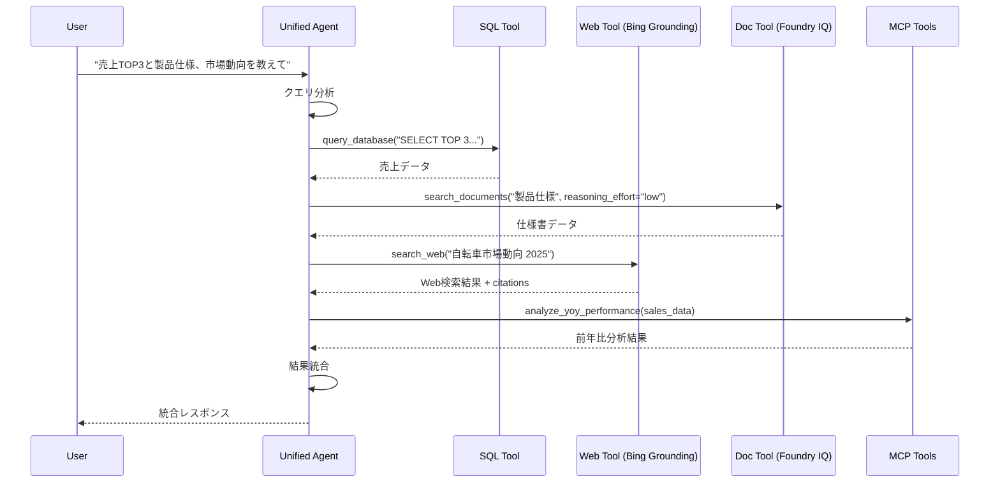
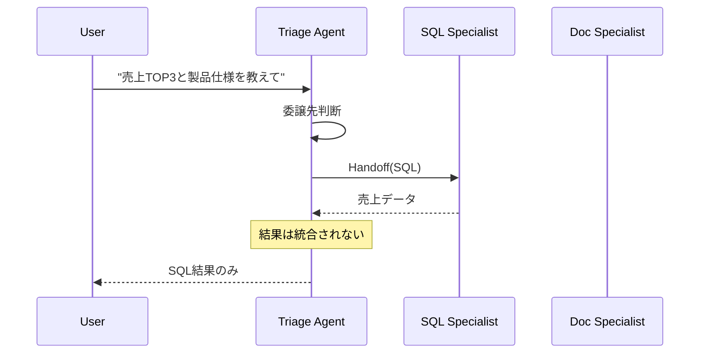

# エージェントアーキテクチャ

> **注**: このドキュメントは現在の実装に基づくエージェント構成を説明します。

## 1. エージェントモード

環境変数 `AGENT_MODE` で動作モードを切り替えられます。

### モード比較

| モード | 速度 | 複雑度 | 用途 | ツール統合 |
| ------ | ---- | ------ | ---- | ---------- |
| `sql_only` | ⚡最速 | シンプル | 単純なSQLクエリ | SQLのみ |
| `multi_tool` | 🔥高速 | 中程度 | **推奨** - 汎用 | 全ツール自動選択 |
| `handoff` | 普通 | 複雑 | 専門家委譲 | 各専門家に委譲 |
| `magentic` | 遅い | 最複雑 | 計画+統合 | マネージャー統合 |

### sql_only モード

単一エージェントでSQLツールのみ使用。最も高速。

```
User → SQL Agent → Fabric SQL → Response
```

**適用例**: "売上TOP3を教えて"

### multi_tool モード（デフォルト・推奨）

単一エージェントが全ツールにアクセス。LLMが最適なツールを選択。

```
User → Unified Agent ─┬─ SQL Tool ──→ Fabric SQL
                      ├─ Web Tool ──→ Bing Search
                      └─ Doc Tool ──→ AI Search
```

**適用例**: "売上データと製品仕様を比較して" → SQL + Doc を順次呼び出し

### handoff モード

トリアージエージェントが専門家に委譲。

```
User → Triage Agent ─┬─ SQL Specialist
                     ├─ Web Specialist
                     └─ Doc Specialist
```

**注意**: 複数専門家の結果は統合されません。最後の専門家の回答が返ります。

### magentic モード

マネージャーが計画し、専門家が実行、結果を統合。

```
User → Manager Agent ─┬─ Plan
                      ├─ SQL Specialist → Result
                      ├─ Web Specialist → Result
                      └─ Integrate Results → Final Response
```

**用途**: 複雑な分析タスク（最も遅いが最も強力）

## 2. クライアントパターン

### SDK クライアント選択

| クライアント | API | 対応モード | 特徴 |
| ------------ | --- | ---------- | ---- |
| `AzureOpenAIResponsesClient` | Responses API v1 | sql_only, multi_tool | 最新API、ツール統合最適化 |
| `AzureOpenAIChatClient` | Chat Completions | handoff, magentic | SDK制約によりWorkflowBuilder使用時必須 |

### 環境変数による切り替え

```python
# AZURE_OPENAI_BASE_URL が設定されている場合 → ResponsesClient
# 設定されていない場合 → ChatClient (フォールバック)

if os.getenv("AZURE_OPENAI_BASE_URL"):
    client = AzureOpenAIResponsesClient(...)
else:
    client = AzureOpenAIChatClient(...)
```

### APIM 経由の Responses API

```bash
# 推奨: APIM 経由で Foundry OpenAI を使用
AZURE_OPENAI_BASE_URL=https://apim-daj6dri4yf3k3z.azure-api.net/foundry-openai/openai/v1/
AZURE_OPENAI_DEPLOYMENT_MODEL=gpt-5
```

---

## 3. エージェント構成

### SQL Agent

**役割**: Fabric SQL データベースへのクエリ実行

```python
@tool
async def query_database(query: str) -> str:
    """Execute SQL query against Fabric SQL Database"""
    # Fabric SQL連携
```

**データスキーマ**:

- `SalesData` - 売上データ
- `Products` - 製品マスタ  
- `Customers` - 顧客マスタ

### Web Agent (BingGroundingAgentTool)

**役割**: Bing Grounding によるWeb検索

```python
# プロジェクトコネクション経由での BingGroundingAgentTool 使用
from azure.ai.agents.models import BingGroundingAgentTool

bing_tool = BingGroundingAgentTool(
    connection_id="/subscriptions/.../connections/bingglobal00149elbd"
)

# ツール登録
tools = [bing_tool]
```

**出力**: 検索結果 + 引用情報（citations）

### Doc Agent (Foundry IQ)

**役割**: Foundry IQ (Agentic Retrieval) でドキュメント検索

```python
# Foundry IQ による Agentic Retrieval
# Reasoning Effort: minimal / low / medium

async def search_documents(query: str, reasoning_effort: str = "low") -> str:
    """Search internal documents using Foundry IQ Agentic Retrieval
    
    Args:
        query: 検索クエリ
        reasoning_effort: 推論レベル
            - minimal: 高速・直接検索（LLMなし）
            - low: シングルパス推論（バランス型、デフォルト）
            - medium: 反復検索（最高品質）
    """
    # Knowledge Base: product-specs-kb
    # Index: product-specs-sharepoint-ks-index
```

**データソース**: `製品仕様書/` フォルダ内のドキュメント（AI Search インデックス）

### MCP Tools

**役割**: MCP Server (Azure Functions) 経由のビジネス分析ツール

```python
# JSON-RPC 2.0 で MCP Server を呼び出し
mcp_tools = [
    "analyze_yoy_performance",      # 前年比分析
    "analyze_rfm_segments",         # 顧客RFM
    "analyze_inventory",            # 在庫最適化
    "analyze_seasonal_trends",      # 季節トレンド
    "analyze_regional_performance", # 地域分析
]
```

---

## 5. ツール呼び出しフロー

### multi_tool モードの例



### handoff モードの例



## 6. 設定方法

### 環境変数

```bash
# モード選択
AGENT_MODE=multi_tool  # sql_only | multi_tool | handoff | magentic

# マルチエージェント有効化（handoff/magentic用）
MULTI_AGENT_MODE=true

# Responses API 使用（推奨）
AZURE_OPENAI_BASE_URL=https://apim-daj6dri4yf3k3z.azure-api.net/foundry-openai/openai/v1/
AZURE_OPENAI_DEPLOYMENT_MODEL=gpt-5

# Bing Grounding
BING_PROJECT_CONNECTION_NAME=bingglobal00149elbd
AZURE_AI_PROJECT_ENDPOINT=https://aisa-daj6dri4yf3k3z.services.ai.azure.com/api/projects/aifp-daj6dri4yf3k3z

# Foundry IQ
AI_SEARCH_KNOWLEDGE_BASE_NAME=product-specs-kb
AI_SEARCH_INDEX_NAME=product-specs-sharepoint-ks-index
AI_SEARCH_REASONING_EFFORT=low  # minimal | low | medium
```

### コード内での切り替え

```python
# chat.py
AGENT_MODE = os.getenv("AGENT_MODE", "multi_tool")

if AGENT_MODE == "sql_only":
    agent = create_sql_only_agent()
elif AGENT_MODE == "multi_tool":
    agent = create_unified_agent()
elif AGENT_MODE == "handoff":
    agent = create_handoff_agent()
elif AGENT_MODE == "magentic":
    agent = create_magentic_agent()
```

## 7. 推奨設定

| シナリオ | 推奨モード | 理由 |
| -------- | ---------- | ---- |
| デモ | `multi_tool` | バランスが良い |
| 高速応答 | `sql_only` | 最速 |
| 複雑な分析 | `magentic` | 結果統合可能 |
| プロダクション | `multi_tool` | 安定・高速 |

---

**関連ドキュメント**:

- [Prompts-Module.md](./Prompts-Module.md) - プロンプト定義
- [Implementation-Overview.md](./Implementation-Overview.md) - 実装概要
