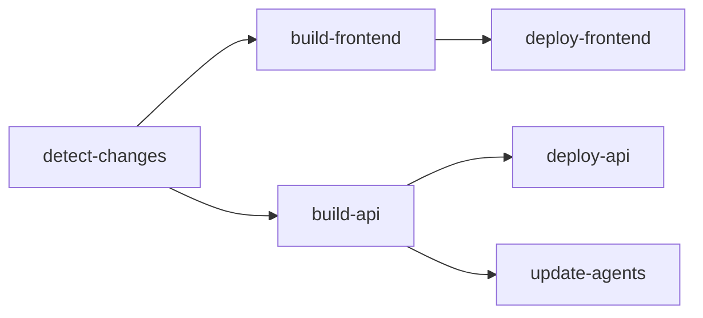

# 現在のデプロイ設定

> **注**: このドキュメントは **Azure 実機環境を確認して** 2026年2月3日に更新されました。
> オリジナルの `azd up` 方式は [DeploymentGuide.md](./DeploymentGuide.md) を参照してください。

## 1. デプロイフロー概要

```text
git push → GitHub Actions → Docker Build → ACR Push → App Service Deploy
```

### トリガー条件

| トリガー | 条件 |
| -------- | ---- |
| Push (main) | `src/App/**`, `src/api/python/**`, `infra/scripts/agent_scripts/agents/**` の変更時 |
| Pull Request | 同上（ビルドのみ、デプロイなし） |
| 手動実行 | workflow_dispatch で任意タイミング |

## 2. ワークフロー構成

### ファイル

```text
.github/workflows/deploy-app-service.yml
```

### ジョブ構成



| ジョブ | 説明 |
| ------ | ---- |
| `detect-changes` | 変更ファイル検出 |
| `build-frontend` | React アプリのDockerビルド |
| `build-api` | Python API のDockerビルド |
| `deploy-frontend` | App Service (Frontend) へデプロイ |
| `deploy-api` | App Service (API) へデプロイ |
| `update-agents` | Foundry Agent 設定更新 |

## 3. Azure リソース（実機確認済み）

### Container Registry

| 項目 | 値（実機確認） |
| ---- | -------------- |
| Name | `crda672axowukix3` |
| Login Server | `crda672axowukix3.azurecr.io` |
| SKU | **Premium** |
| Location | East US |
| Frontend Image | `da-app` |
| API Image | `da-api` |

### App Service（実機確認済み）

| 項目 | 値（実機確認） |
| ---- | -------------- |
| Frontend | `app-daj6dri4yf3k3z` |
| API | `api-daj6dri4yf3k3z` |
| App Service Plan | `asp-daj6dri4yf3k3z` |
| Resource Group | `rg-agent-unified-data-acce-eastus-001` |
| Kind | Linux Container |
| Location | **Australia East** |
| State | Running |

### エンドポイント（実機確認済み）

| サービス | URL |
| -------- | --- |
| Frontend | `https://app-daj6dri4yf3k3z.azurewebsites.net` |
| API | `https://api-daj6dri4yf3k3z.azurewebsites.net` |

## 4. GitHub Secrets 設定

以下のシークレットが必要です:

| シークレット | 説明 |
| ------------ | ---- |
| `ACR_LOGIN_SERVER` | Azure Container Registry サーバー |
| `ACR_USERNAME` | ACR ユーザー名 |
| `ACR_PASSWORD` | ACR パスワード |
| `AZURE_CREDENTIALS` | Azure サービスプリンシパル（JSON） |

### GitHub Variables

| 変数 | 説明 | 実機の値 |
| ---- | ---- | -------- |
| `FRONTEND_APP_NAME` | Frontend App Service 名 | `app-daj6dri4yf3k3z` |
| `API_APP_NAME` | API App Service 名 | `api-daj6dri4yf3k3z` |
| `RESOURCE_GROUP` | リソースグループ名 | `rg-agent-unified-data-acce-eastus-001` |

## 5. デプロイ手順

### 通常のデプロイ（自動）

```bash
# 変更をコミット
git add .
git commit -m "fix: 修正内容"

# プッシュ = 自動デプロイ
git push
```

GitHub Actions が自動的に:

1. 変更を検出
2. 該当コンポーネントのみビルド
3. ACR にプッシュ
4. App Service を更新

### 手動デプロイ

1. GitHub リポジトリの **Actions** タブへ
2. **Build and Deploy to Azure App Service** を選択
3. **Run workflow** をクリック
4. オプション選択:
   - Deploy Frontend: ✓/✗
   - Deploy API: ✓/✗
   - Environment: dev/staging/prod

## 6. Docker イメージ

### Frontend (React)

```dockerfile
# src/App/WebApp.Dockerfile
FROM node:18-alpine AS build
WORKDIR /app
COPY package*.json ./
RUN npm ci
COPY . .
RUN npm run build

FROM nginx:alpine
COPY --from=build /app/build /usr/share/nginx/html
```

### API (Python FastAPI)

```dockerfile
# src/api/python/ApiApp.Dockerfile
FROM python:3.11-slim
WORKDIR /app
COPY requirements.txt .
RUN pip install -r requirements.txt
COPY . .
CMD ["uvicorn", "main:app", "--host", "0.0.0.0", "--port", "8000"]
```

## 7. デプロイ確認

### ステータス確認

- GitHub Actions: リポジトリの **Actions** タブ
- App Service: Azure Portal → App Service → Deployment Center

### ログ確認

```bash
# API ログ（Azure CLI）
az webapp log tail --name api-daj6dri4yf3k3z --resource-group rg-agent-unified-data-acce-eastus-001

# Frontend ログ
az webapp log tail --name app-daj6dri4yf3k3z --resource-group rg-agent-unified-data-acce-eastus-001
```

## 8. トラブルシューティング

### ビルド失敗

1. GitHub Actions のログを確認
2. Docker ビルドエラーを特定
3. ローカルで `docker build` を実行してデバッグ

### デプロイ失敗

1. Azure Portal で App Service の状態確認
2. Deployment Center のログ確認
3. Container のスタートアップログ確認

### よくある問題

| 症状 | 原因 | 対処 |
| ---- | ---- | ---- |
| ビルドスキップ | 変更検出されず | paths 設定確認、手動実行 |
| ACR プッシュ失敗 | 認証エラー | シークレット確認 |
| App 起動失敗 | 環境変数不足 | App Settings 確認 |

## 9. オリジナルデプロイ方式（azd up）

初回セットアップや環境再構築には `azd up` が利用可能です:

```bash
azd auth login
azd up
```

詳細は [DeploymentGuide.md](./DeploymentGuide.md) を参照。

---

**関連ドキュメント**:

- [DeploymentGuide.md](./DeploymentGuide.md) - オリジナルデプロイガイド（azd up）
- [GitHubActionsSetup.md](./GitHubActionsSetup.md) - GitHub Actions 初期設定
- [Implementation-Overview.md](./Implementation-Overview.md) - 実装概要
