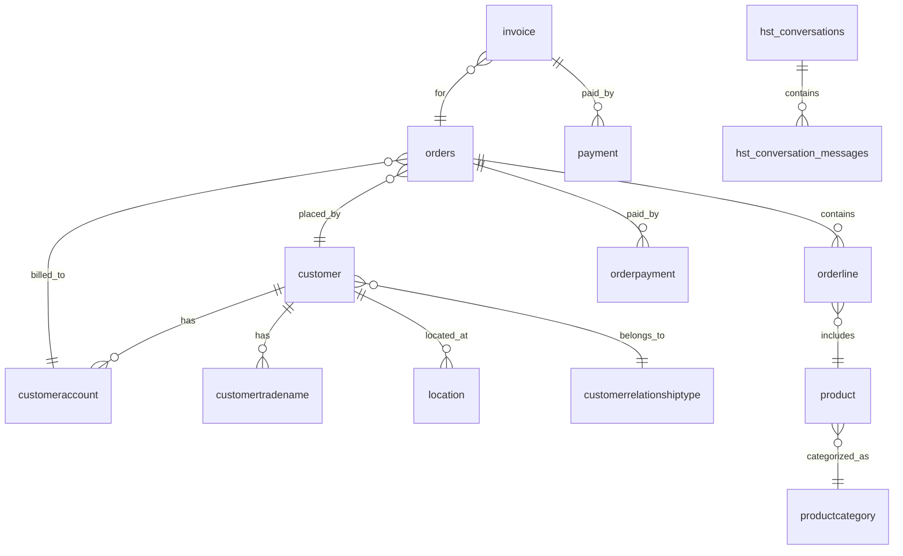

# Fabric SQL Database データモデル

このドキュメントでは、Microsoft Fabric SQL Database に格納されているデータの構造と関係性を説明します。

## 概要

データは **Retail（小売）シナリオ** のサンプルデータで、Sales Analyst ユースケースをサポートするように設計されています。

```
┌─────────────────────────────────────────────────────────────────────────────────────┐
│                              Fabric SQL Database                                     │
├─────────────────────────────────────────────────────────────────────────────────────┤
│  ┌─────────────────────────────────────────────────────────────────────────────┐    │
│  │ 業務データ (Retail)                                                         │    │
│  │ ├── customer (顧客)                                                        │    │
│  │ ├── customeraccount (顧客アカウント)                                       │    │
│  │ ├── customertradename (取引名)                                             │    │
│  │ ├── customerrelationshiptype (顧客関係タイプ)                              │    │
│  │ ├── location (住所・ロケーション)                                          │    │
│  │ ├── product (商品)                                                         │    │
│  │ ├── productcategory (商品カテゴリ)                                         │    │
│  │ ├── orders (注文)                                                          │    │
│  │ ├── orderline (注文明細)                                                   │    │
│  │ ├── orderpayment (注文支払い)                                              │    │
│  │ ├── account (勘定)                                                         │    │
│  │ ├── invoice (請求書)                                                       │    │
│  │ └── payment (支払い)                                                       │    │
│  └─────────────────────────────────────────────────────────────────────────────┘    │
│  ┌─────────────────────────────────────────────────────────────────────────────┐    │
│  │ 会話履歴                                                                    │    │
│  │ ├── hst_conversations (会話)                                               │    │
│  │ └── hst_conversation_messages (メッセージ)                                 │    │
│  └─────────────────────────────────────────────────────────────────────────────┘    │
└─────────────────────────────────────────────────────────────────────────────────────┘
```

---

## ER図（簡略版）



---

## テーブル詳細

### 1. 顧客系テーブル

#### customer（顧客マスタ）

| カラム | 型 | 説明 |
|--------|-----|------|
| CustomerId | NVARCHAR(100) | 顧客ID（PK）例: CID-001 |
| CustomerTypeId | NVARCHAR(100) | 顧客タイプ: Individual, Business, Government |
| CustomerRelationshipTypeId | NVARCHAR(100) | 関係タイプ: VIP, Premium, Standard, SMB, Partner |
| DateOfBirth | DATE | 生年月日 |
| CustomerEstablishedDate | DATE | 顧客開始日 |
| IsActive | BIT | アクティブフラグ |
| FirstName, LastName | NVARCHAR(100) | 氏名 |
| Gender | NVARCHAR(100) | 性別 |
| PrimaryPhone, SecondaryPhone | NVARCHAR(100) | 電話番号 |
| PrimaryEmail, SecondaryEmail | NVARCHAR(100) | メールアドレス |

**レコード数**: 約513件

**顧客タイプ分布**:
- Individual（個人）: 多数
- Business（法人）: SMB、Partner
- Government（政府機関）: Local、State、Federal

#### customeraccount（顧客アカウント）

| カラム | 型 | 説明 |
|--------|-----|------|
| CustomerAccountId | NVARCHAR(100) | アカウントID（PK）例: CA-0001 |
| ParentAccountId | NVARCHAR(100) | 親アカウントID |
| CustomerAccountName | NVARCHAR(100) | アカウント名: Fabric, ADB |
| CustomerId | NVARCHAR(100) | 顧客ID（FK） |
| IsoCurrencyCode | NVARCHAR(100) | 通貨コード: USD |

#### location（ロケーション）

| カラム | 型 | 説明 |
|--------|-----|------|
| LocationId | NVARCHAR(100) | ロケーションID（PK） |
| CustomerId | NVARCHAR(100) | 顧客ID（FK） |
| AddressLine1, AddressLine2 | NVARCHAR(100) | 住所 |
| City | NVARCHAR(100) | 市 |
| StateId | NVARCHAR(100) | 州: CA, AZ, TX など |
| ZipCode | NVARCHAR(100) | 郵便番号 |
| Region | NVARCHAR(100) | 地域: West Coast, Mountain West など |
| Latitude, Longitude | NVARCHAR(100) | 緯度・経度 |

---

### 2. 商品系テーブル

#### product（商品マスタ）

| カラム | 型 | 説明 |
|--------|-----|------|
| ProductID | INT | 商品ID（PK） |
| ProductName | NVARCHAR(100) | 商品名 |
| ProductDescription | NVARCHAR(MAX) | 商品説明 |
| BrandName | NVARCHAR(100) | ブランド: Contoso Outdoor, Contoso Gears |
| Color | NVARCHAR(100) | 色: Black, Red, Blue, White, Multi |
| ProductCategoryID | NVARCHAR(100) | カテゴリID（FK） |
| CategoryName | NVARCHAR(100) | カテゴリ名 |
| ListPrice | DECIMAL(10,2) | 定価 |
| StandardCost | DECIMAL(10,2) | 標準原価 |
| ProductStatus | NVARCHAR(100) | ステータス: active |

**商品カテゴリ例**:
- Road Frames（ロードフレーム）
- Helmets（ヘルメット）
- Jerseys（ジャージ）
- Socks（ソックス）
- Caps（キャップ）
- Tents（テント）
- Camping Tables（キャンプテーブル）
- Sleeping Bags（寝袋）

#### productcategory（商品カテゴリ）

| カラム | 型 | 説明 |
|--------|-----|------|
| CategoryID | INT | カテゴリID（PK） |
| ParentCategoryId | NVARCHAR(100) | 親カテゴリID |
| CategoryName | NVARCHAR(100) | カテゴリ名 |
| BrandName | NVARCHAR(100) | ブランド名 |
| IsActive | BIT | アクティブフラグ |

---

### 3. 注文系テーブル

#### orders（注文ヘッダ）

| カラム | 型 | 説明 |
|--------|-----|------|
| OrderId | NVARCHAR(100) | 注文ID（PK）UUID形式 |
| SalesChannelId | NVARCHAR(100) | 販売チャネル: Fabric, ADB |
| OrderNumber | NVARCHAR(100) | 注文番号: F100000 |
| CustomerId | NVARCHAR(100) | 顧客ID（FK） |
| CustomerAccountId | NVARCHAR(100) | 顧客アカウントID（FK） |
| OrderDate | DATE | 注文日 |
| OrderStatus | NVARCHAR(100) | ステータス: Completed, Pending, Cancelled |
| SubTotal | DECIMAL(10,2) | 小計 |
| TaxAmount | DECIMAL(10,2) | 税額 |
| OrderTotal | DECIMAL(10,2) | 合計金額 |
| PaymentMethod | NVARCHAR(100) | 支払方法: MC, VISA, PayPal, Discover |

**注文期間**: 2019年〜2025年

#### orderline（注文明細）

| カラム | 型 | 説明 |
|--------|-----|------|
| OrderLineId | NVARCHAR(100) | 明細ID（PK） |
| OrderId | NVARCHAR(100) | 注文ID（FK） |
| ProductId | INT | 商品ID（FK） |
| Quantity | INT | 数量 |
| UnitPrice | DECIMAL(10,2) | 単価 |
| LineTotal | DECIMAL(10,2) | 明細合計 |

#### orderpayment（注文支払い）

| カラム | 型 | 説明 |
|--------|-----|------|
| OrderId | NVARCHAR(100) | 注文ID（FK） |
| PaymentMethod | NVARCHAR(100) | 支払方法 |
| TransactionId | NVARCHAR(100) | トランザクションID |

---

### 4. 会計系テーブル

#### invoice（請求書）

| カラム | 型 | 説明 |
|--------|-----|------|
| InvoiceId | NVARCHAR(100) | 請求書ID（PK） |
| OrderId | NVARCHAR(100) | 注文ID（FK） |
| InvoiceDate | DATE | 請求日 |
| DueDate | DATE | 支払期限 |
| InvoiceAmount | DECIMAL(10,2) | 請求金額 |
| InvoiceStatus | NVARCHAR(100) | ステータス |

#### payment（支払い）

| カラム | 型 | 説明 |
|--------|-----|------|
| PaymentId | NVARCHAR(100) | 支払いID（PK） |
| InvoiceId | NVARCHAR(100) | 請求書ID（FK） |
| PaymentDate | DATE | 支払日 |
| PaymentAmount | DECIMAL(10,2) | 支払金額 |
| PaymentMethod | NVARCHAR(100) | 支払方法 |

#### account（勘定）

| カラム | 型 | 説明 |
|--------|-----|------|
| AccountId | NVARCHAR(100) | 勘定ID（PK） |
| AccountName | NVARCHAR(100) | 勘定名 |
| AccountType | NVARCHAR(100) | 勘定タイプ |
| Balance | DECIMAL(10,2) | 残高 |

---

### 5. 会話履歴テーブル

#### hst_conversations（会話）

| カラム | 型 | 説明 |
|--------|-----|------|
| Id | INT | ID（PK、自動採番） |
| userId | NVARCHAR(50) | ユーザーID |
| conversation_id | NVARCHAR(50) | 会話ID（UUID） |
| title | NVARCHAR(255) | 会話タイトル |
| createdAt | DATETIME2(7) | 作成日時 |
| updatedAt | DATETIME2(7) | 更新日時 |

#### hst_conversation_messages（メッセージ）

| カラム | 型 | 説明 |
|--------|-----|------|
| Id | INT | ID（PK、自動採番） |
| userId | NVARCHAR(50) | ユーザーID |
| conversation_id | NVARCHAR(50) | 会話ID（FK） |
| role | NVARCHAR(50) | ロール: user, assistant |
| content_id | NVARCHAR(50) | コンテンツID |
| content | NVARCHAR(MAX) | メッセージ内容 |
| citations | NVARCHAR(MAX) | 引用情報（JSON） |
| feedback | NVARCHAR(MAX) | フィードバック |
| createdAt | DATETIME2(7) | 作成日時 |
| updatedAt | DATETIME2(7) | 更新日時 |

---

## サンプルクエリ

### 売上分析

```sql
-- 顧客別売上合計
SELECT 
    c.CustomerId,
    c.FirstName + ' ' + c.LastName AS CustomerName,
    c.CustomerRelationshipTypeId AS RelationshipType,
    SUM(o.OrderTotal) AS TotalSales,
    COUNT(o.OrderId) AS OrderCount
FROM customer c
JOIN orders o ON c.CustomerId = o.CustomerId
WHERE o.OrderStatus = 'Completed'
GROUP BY c.CustomerId, c.FirstName, c.LastName, c.CustomerRelationshipTypeId
ORDER BY TotalSales DESC;
```

### 商品カテゴリ別売上

```sql
-- カテゴリ別売上
SELECT 
    p.CategoryName,
    SUM(ol.LineTotal) AS TotalRevenue,
    SUM(ol.Quantity) AS TotalQuantity
FROM orderline ol
JOIN product p ON ol.ProductId = p.ProductID
JOIN orders o ON ol.OrderId = o.OrderId
WHERE o.OrderStatus = 'Completed'
GROUP BY p.CategoryName
ORDER BY TotalRevenue DESC;
```

### 地域別分析

```sql
-- 地域別売上
SELECT 
    l.Region,
    l.StateId,
    COUNT(DISTINCT o.CustomerId) AS UniqueCustomers,
    SUM(o.OrderTotal) AS TotalSales
FROM location l
JOIN orders o ON l.CustomerId = o.CustomerId
GROUP BY l.Region, l.StateId
ORDER BY TotalSales DESC;
```

---

## データ投入

データは Fabric セットアップ時に以下のスクリプトで投入されます：

```
infra/scripts/fabric_scripts/sql_files/
├── data_sql.sql           # 会話履歴テーブル
└── retail_data_sql.sql    # 業務データ（約15,000行）
```

実行は `azure.yaml` の postprovision フックで自動的に行われます。

---

## 関連ドキュメント

- [ARCHITECTURE.md](../ARCHITECTURE.md) - 全体アーキテクチャ
- [Agent-Architecture.md](./Agent-Architecture.md) - エージェント構成
- [Fabric_deployment.md](./Fabric_deployment.md) - Fabric デプロイ手順
